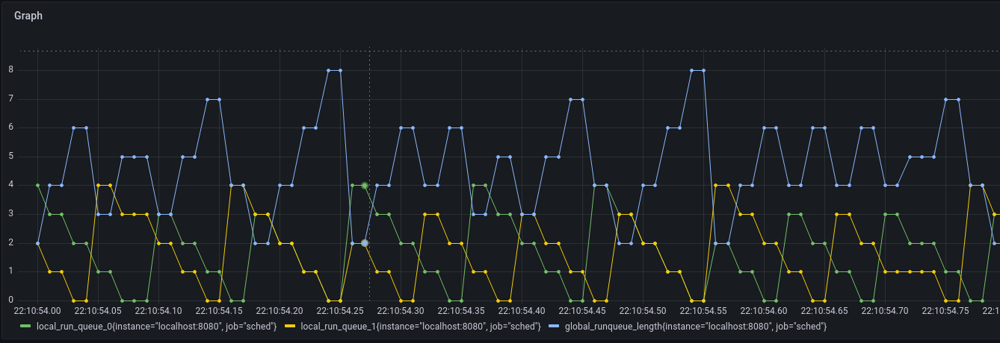

# gse
<p align="center">
    
</p>

`gse` stands for Go Scheduler Exporter and contains the source and setup required to run the demo that was done as part of the talk [Queues, Fairness, and The Go Scheduler](https://www.gophercon.com/agenda/session/596208). The slides for the talk can be found [here](https://speakerdeck.com/madhavjivrajani/queues-fairness-and-the-go-scheduler).

## Working
On a high level:
- `gse` exports scheduler traces for a particular binary to Prometheus to help observe and visualize the Go runtime scheduler.
- It takes a config file which looks as follows:
    ```yaml
    path: "cmd to execute binary"
    prometheus:
      endpoint: metrics
      port: 8080
    sched:
      interval: 10 # frequency in ms at which scheduler traces will be emitted.
    ```
    Please see the comments [here](./pkg/utils/config.go) for more details on these fields.
- The metrics exported are as follows:
    - Run queue lengths of local runqueues
    - Run queue length of global runqueue
    - No. of idle procs
    - No. of threads
    - No. of spinning threads
    - No. of idle threads
- These metrics can now be viewed in `grafana`.

## Running `gse`
### Get and build `gse`
```sh
git clone https://github.com/MadhavJivrajani/gse.git && cd gse
go build .
# optional
mv ./gse /usr/local/bin
```
### Run `gse`
An example program and config file can be found [here](./example).
#### Compile the program
```sh
go build -o gophercon main.go
```
#### Running `gse`
Before actually running `gse`, make sure you have prometheus running whose config matches the `prometheus` part of the config provided to `gse`. The config I used and passed to a locally running `prometheus` was:
```yaml
global:
  scrape_interval: 10ms

scrape_configs:
  - job_name: "sched"
    static_configs:
      - targets: ["localhost:8080"]
```
The `10ms` scrape interval is provided since `10ms` is also the timeslice given to a gorotuine, post which async preemption is attempted, and hence visualization becomes significantly clearer.  

Actually run `gse` now:
```sh
gse -f example/test.yaml
```
Once running, you can open up `grafana` and add `prometheus` as a data source and visualize the exported metrics:


---

## Tracing `SIGURG`
This part is orthogonal to `gse`, but here for reference!
To trace when a long running Gorutine is asynchronously preempted using the `SIGURG` signal, we can make use of the Linux tracing subsystem to get events whenever the `SIGURG` signal is issued.  

To set things up, you need to be a root user first. Once you are, run the following:
```sh
./example/preemption_tracing/setup.sh
```

In our example, the name of the binary was `gophercon`. If we search through the trace log for `gophercon`, we should be able to see the preemption events.
```sh
cat /sys/kernel/debug/tracing/trace | grep gophercon
```